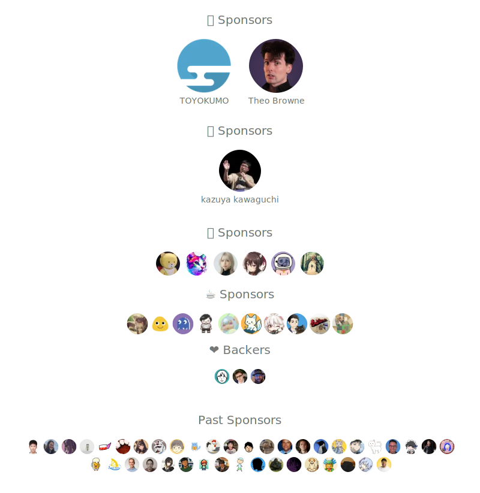

# ryoppippi's sponsors

 <!-- spellchecker:disable-line -->
    
    
    
Thank you to all my sponsors for supporting my work!

## Deployment

This repository deploys the generated sponsor assets with Cloudflare Workers
Static Assets. Review `compatibility_date` in `wrangler.jsonc` when adopting
new Workers runtime behaviour or updating the deployment configuration.
